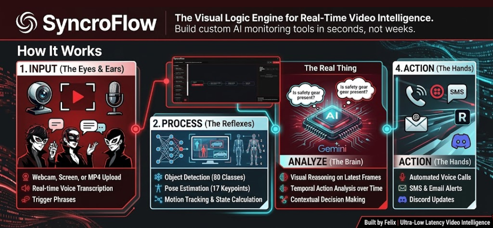

<div align="center">
    # SyncroFlow 
    *Demo Video*
    [](https://www.youtube.com/watch?v=z0_sX_81Mok)
    A visual logic engine for real-time video intelligence that transforms complex AI video pipelines into simple, drag-and-drop nodes using ultra-low latency WebRTC streaming.
</div>

## Overview

SyncroFlow enables users to build custom computer vision and AI monitoring tools in seconds without requiring weeks of development. It combines drag-and-drop visual programming with AI-powered video analysis capabilities.

## Core Features

- **Drag-and-Drop Editor**: React Flow-based visual interface for intuitive AI pipeline creation
- **Ultra-Low Latency Video**: Sub-500ms WebRTC streaming via Ant Media Server integration
- **Temporal AI Monitoring**: Rolling frame buffers for action understanding over time
- **Multi-Source Inputs**: Support for webcams, MP4 files, screen shares, and RTMP streams
- **No-Code Automation**: Trigger real-world events based on AI analysis conditions

## Technology Stack

**Frontend**: React 18, Vite, React Flow, Tailwind CSS
**Backend API**: Node.js / Express
**AI/Vision Backend**: Python, FastAPI, YOLOv8
**Video Infrastructure**: Ant Media Server, WebRTC, RTMP
**AI Models**: Gemini Pro Vision / OpenRouter API

## Requirements

- Node.js v22.13+
- Python 3.11+
- Ant Media Server Community Edition (Optional)

## Setup Instructions

1.  Clone the Repository
    ```cmd
    git clone https://github.com/FelixMatrixar/SyncroFlow.git
    cd SyncroFlow
    ```

2.  Environment Variables
    Create a .env file in the root directory. The system relies on these keys for AI inference and external communication nodes:
    ```bash
    OPENROUTER_API_KEY=your_openrouter_key  # Required for visual/audio analysis nodes

    TWILIO_ACCOUNT_SID=your_twilio_sid      # For SMS & Voice Call nodes
    TWILIO_AUTH_TOKEN=your_twilio_token
    TWILIO_PHONE_NUMBER=+1234567890
    ```

3.  Python AI Backend Setup
    The Python engine handles the heavy lifting for YOLOv11 ONNX models and temporal execution sessions.
    ```cmd
    # Navigate to the backend directory
    cd python_backend

    # Create and activate a virtual environment
    python -m venv venv
    source venv/bin/activate  # On Windows use: venv\Scripts\activate

    # Install dependencies
    pip install -r requirements.txt
    ```
    Note: On the first run, the server will automatically attempt to download the required YOLOv11 ONNX models into the local models/ directory.

4.  Node.js Orchestrator Setup
    The Express server manages the workflow logic, file uploads (up to 200MB for videos), and WebSocket connections.
    ```cmd
    # Open a new terminal instance in the project root
    npm install

    # Start the development server
    npm run dev
    ```

5.  Automatic Directory Creation
    Upon running, the system will automatically generate the following local directories for storage:
    - `python_backend/models/`: Stores downloaded YOLO .onnx and COCO classes files.
    - `uploads/videos/`: Disk storage for user-uploaded MP4/WebM files.
    - `results/`: Stores saved JSON/CSV analysis outputs.

## License
MIT License
